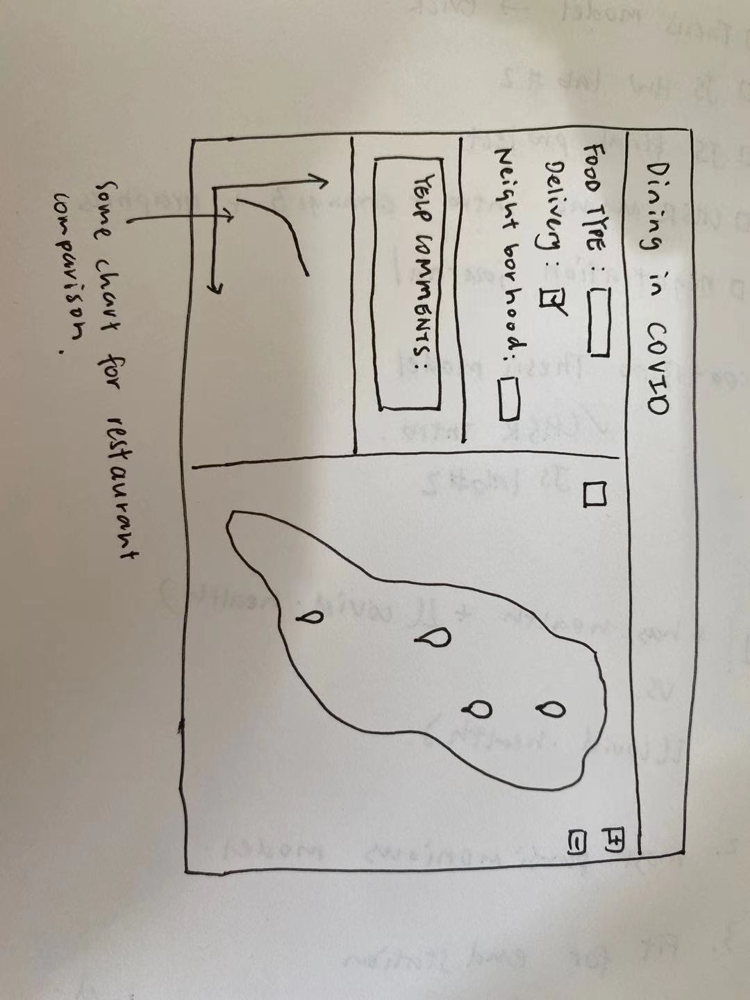

# Final Project Proposal 
Han Qiao, Tzu Wang, Jingzong Wang

## Problem / Question

We hope to provide better dining experiences (in Philadelphia) during COVID. After the outbreak of COVID-19, a lot of restaurants were closed at first, then started to offer outdoor dining and partnered up with delivery services. So we hope to create a web application that gathers restaurant information during COVID and COVID cases in the area, so that people can make better decisions on where to eat.

## The data

We are planning on using open data provided by Yelp Fusion APIs (https://www.yelp.com/fusion), Google Place API, and data on COVID-19 cases (https://cityofphiladelphia.github.io/carto-api-explorer/#covid_cases_by_zip). The data from Yelp is in the JSON format and provides information on restaurant location, restaurant type, hours, ratings and reviews. We are thinking about also using Google Place API for more information on the business especially in relation to the changes in service during the pandemic. We are also thinking about using data on COVID-19 cases and their location. We plan to use the API to get the data instead of storing it on a backend. 

Yelp: https://www.yelp.com/fusion
Covid: https://cityofphiladelphia.github.io/carto-api-explorer/#covid_cases_by_zip

## Technologies used

We will be using leaflet for making maps, JQuery for making maps interactive, underscore for fundamental functions to wrangle the data, D3 for data visualization and bootstrap to build the front-end.

## Design spec

#### User experience

Users: people who are searching for restaurants during COVID.
Gain: Users will have a better understanding of the restaurant service provided as well as the surrounding area’s cases.
Past example: Our application will be a simplified version of the Yelp App and with more information on COVID cases.

#### Layouts and visual design

## Anticipated difficulties

One difficulty is that we need to figure out how to use the API to get data. Another difficulty is how we can handle the big data set and whether leaflet can handle the data. 

